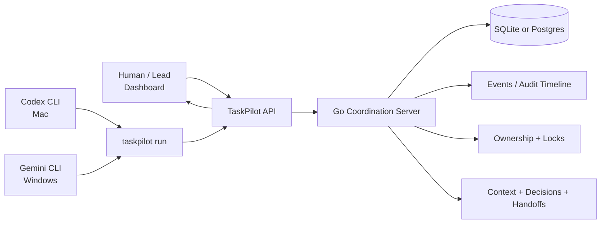
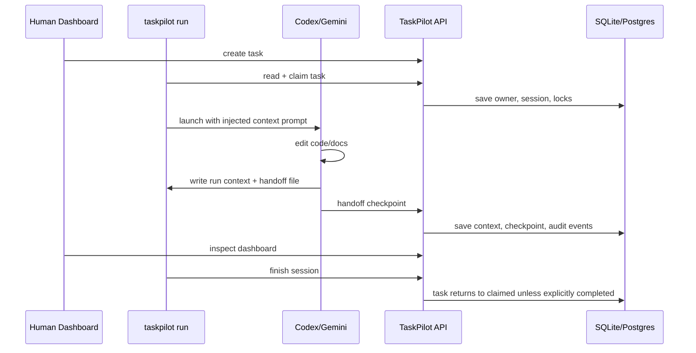

# TaskPilot

TaskPilot is a shared coordination system for humans and AI agents working across machines. It gives agents a CLI wrapper and gives humans a dashboard over the same task state.

The main idea is simple:

```text
TaskPilot is shared work memory plus coordination rules for Codex, Gemini, and humans.
```

Use it when two or more people or agents need to work on the same codebase without losing task context, decisions, locks, handoffs, or ownership.

## Start Here

- Team onboarding guide: [docs/ONBOARDING.md](docs/ONBOARDING.md)
- Detailed working flow diagram: [docs/TASKPILOT_WORKING_FLOW.md](docs/TASKPILOT_WORKING_FLOW.md)
- Technical decisions: [docs/TECHNICAL_DECISIONS.md](docs/TECHNICAL_DECISIONS.md)
- Agent rules for this repo: [AGENTS.md](AGENTS.md)

## How It Fits Together



The dashboard and CLI are two interfaces over the same server. If Codex updates a task from the CLI, the dashboard sees it. If a lead publishes a handoff from the dashboard, the next agent sees it from the CLI.

## What TaskPilot Can Do Now

- Create and manage tasks with goal, type, priority, scope, owner, project, repo, and workspace.
- Track task lifecycle: `ready`, `claimed`, `in_progress`, `blocked`, `handoff_ready`, `in_review`, `completed`, `cancelled`.
- Claim tasks and prevent overlapping ownership.
- Acquire file, semantic-area, artifact, and task-level locks.
- Detect and explain conflicts and stale claims.
- Record structured context, decisions, comments, artifacts, and git metadata.
- Split work into subtasks and dependencies.
- Run Codex, Gemini, or another agent through `taskpilot run`.
- Inject current task context and selected related task context into the agent prompt.
- Maintain an agent-authored handoff file during the run.
- Save handoff checkpoints after meaningful work units.
- Warn loudly when a handoff is weak, placeholder, or not checkpointed.
- Show task board, detail, memory, conflicts, handoffs, projects, actors, repos, workspaces, and settings in the dashboard.
- Use SQLite locally or Postgres for shared team deployments.

## Install The CLI

The CLI should be available as `taskpilot` from any repo. This is important because agents naturally call `taskpilot`, not an absolute path inside the TaskPilot source folder.

Mac/Linux:

```bash
git pull
make install
```

Windows:

```powershell
git pull
powershell -ExecutionPolicy Bypass -File .\scripts\install-windows.ps1
```

Check:

```bash
which taskpilot      # Mac/Linux
taskpilot config show
```

On Mac/Linux, keep this in `~/.zshrc` or your shell profile:

```bash
export PATH="$HOME/.local/bin:$PATH"
```

## Run The Server

Local SQLite development:

```bash
make install
taskpilot serve --addr 127.0.0.1:8080 --db taskpilot.db
```

Open:

```text
http://127.0.0.1:8080
```

Docker with Postgres:

```bash
docker compose up -d --build
```

Health checks:

```bash
curl http://127.0.0.1:8080/healthz
curl http://127.0.0.1:8080/readyz
```

## CLI Setup

TaskPilot dashboard login uses only email and password. Actor setup happens after login:

1. Open the dashboard.
2. Sign up or log in with email and password.
3. Open **Actors**.
4. Create or select your actor, for example `anuj_codex` or `rahul_gemini`.
5. Open **Settings** and copy the CLI setup command for that actor.

For the machine running the server:

```bash
taskpilot login --server http://127.0.0.1:8080 --email anuj@company.com
taskpilot config set-actor <actor-id> <actor-secret>
```

For another laptop on the same network:

```bash
taskpilot login --server http://<server-lan-ip>:8080 --email teammate@company.com
taskpilot config set-actor <actor-id> <actor-secret>
```

## Basic Task Flow

```bash
taskpilot task create \
  --title "Fix invited-user signup" \
  --goal "Find and fix invited-user signup failure" \
  --type debugging \
  --priority high \
  --scope "src/auth/*"

taskpilot task list
taskpilot task show <task-id>
taskpilot task claim <task-id>
taskpilot lock acquire <task-id> --scope "src/auth/*"
```

Add durable context:

```bash
taskpilot context append <task-id> \
  --kind decision \
  --content "Keep token format unchanged. Patch expiry comparison only."
```

Add a first-class decision:

```bash
taskpilot decision add <task-id> \
  --decision "Keep token format unchanged" \
  --reason "Existing invite links must keep working" \
  --impact "Patch only expiry validation"
```

Attach outputs:

```bash
taskpilot artifact add <task-id> \
  --kind pr \
  --title "Signup fix PR" \
  --uri "https://github.com/acme/app/pull/42"

taskpilot git link-branch <task-id>
taskpilot git attach-pr <task-id> "https://github.com/acme/app/pull/42"
```

## Agent Automation

The most important workflow is:

```bash
taskpilot run <task-id> -- codex "your prompt"
taskpilot run <task-id> -- gemini "your prompt"
```

`taskpilot run` does the coordination work around the child agent:

1. Reads the task from the server.
2. Claims the task if available.
3. Starts a session and moves the task to `in_progress`.
4. Acquires task/scope locks.
5. Sends heartbeats while the agent runs.
6. Creates task context and related-context files.
7. Injects a startup prompt into known agents like Codex and Gemini.
8. Creates `TASKPILOT_RUN_CONTEXT_FILE` for incremental notes.
9. Creates `TASKPILOT_HANDOFF_FILE` for transfer-ready memory.
10. Imports useful context and handoff checkpoints.
11. On normal exit, returns the task to `claimed`, not `completed`.
12. Completion happens only through an explicit complete action.

When prompt injection is active, the terminal shows:

```text
TaskPilot: injected startup pointer into codex prompt. Full TaskPilot prompt file: /tmp/taskpilot-...-prompt-....txt
TaskPilot: handoff draft file: /tmp/taskpilot-...-handoff-....md
TaskPilot: after each meaningful work unit, update the handoff draft and run: taskpilot handoff checkpoint ...
```

The visible agent prompt points to the full prompt file and includes the human prompt:

```text
TaskPilot task <task-id>: before doing any repository analysis or edits, read the full TaskPilot instructions from <prompt-file> and follow them exactly. Human prompt for this work unit: your prompt
```

## Agent Context And Handoff Files

The child agent receives these environment variables:

```text
TASKPILOT_TASK_ID
TASKPILOT_SERVER
TASKPILOT_ACTOR_ID
TASKPILOT_SESSION_ID
TASKPILOT_HANDOFF_PACKET_ID
TASKPILOT_PROJECT_ID
TASKPILOT_REPO_ID
TASKPILOT_WORKSPACE_ID
TASKPILOT_TASK_CONTEXT_FILE
TASKPILOT_RELATED_CONTEXT_FILE
TASKPILOT_RUN_CONTEXT_FILE
TASKPILOT_HANDOFF_FILE
TASKPILOT_AGENT_PROMPT_FILE
TASKPILOT_AGENT_INSTRUCTIONS
```

Write incremental notes to `TASKPILOT_RUN_CONTEXT_FILE`:

```text
summary: Added invited-user regression coverage.
finding: Failure happens after token lookup during expiry comparison.
decision: Keep token format unchanged because existing invite links depend on it.
risk: Timezone handling may still need edge-case coverage.
files: src/auth/invite.go, src/auth/invite_test.go
verification: go test ./src/auth passed.
next: Patch already-used invite token handling.
```

Keep `TASKPILOT_HANDOFF_FILE` updated after each meaningful prompt response or work unit, then checkpoint it:

```bash
taskpilot handoff checkpoint "$TASKPILOT_TASK_ID" --file "$TASKPILOT_HANDOFF_FILE"
```

If the handoff is still weak or placeholder text when the agent exits, TaskPilot prints a warning and keeps the handoff file on disk so it can be fixed manually.

## Handoff Workflow

Use handoffs when another agent or developer should continue.

CLI:

```bash
taskpilot handoff prepare <task-id> \
  --summary "Root cause traced to expiry comparison. Token format should stay unchanged." \
  --next "Add failing regression test" \
  --next "Patch expiry comparison"
```

Dashboard:

1. Open task detail.
2. Go to Task Memory.
3. Click "Prepare handoff for other agent".
4. Edit summary and next steps in the modal.
5. Publish handoff.
6. Another actor accepts it from the Handoffs page.

The best handoffs include:

- Completed work.
- Important decisions and reasons.
- Current state.
- Remaining work.
- Suggested next steps.
- Files/components affected.
- Risks, blockers, assumptions, and references.

## Dashboard

The dashboard supports:

- Task board with search and filters.
- Task detail with memory, decisions, comments, artifacts, git, locks, handoffs, and timeline.
- Task creation even from empty states.
- Project, repository, and workspace management.
- Actors and identity settings.
- Conflict and stale-claim views.
- Handoff page for published handoffs.
- Task memory preview, latest handoff preview, editable Markdown, and publish flow.

Dashboard actions call the same API as the CLI, so humans and agents stay consistent.

## Architecture In One Picture



## Auth

Development token auth:

```http
Authorization: Bearer <team-token>
X-Actor-ID: <actor-id>
X-Actor-Secret: <actor-secret>
```

API key auth:

```http
Authorization: ApiKey <tpk_...>
```

Human dashboard session auth:

```http
POST /api/auth/login
Cookie: taskpilot_session=<session>
```

For current internal testing, token auth is the simplest path. API keys and user login are available for more accountable setups.

## Operations

Migration and backup:

```bash
taskpilot migrate status
taskpilot migrate up
taskpilot backup create --out taskpilot-backup.db
taskpilot backup restore --in taskpilot-backup.db
```

Observability:

```text
GET /healthz
GET /readyz
GET /metrics
```

## Privacy Boundary

TaskPilot stores structured task context, decisions, comments, ownership, locks, handoff memory, artifact references, git metadata, and audit events.

TaskPilot does not store raw local files, secrets, full private prompts, private logs, screenshots, or customer data by default.
