# TaskPilot App Flow

## 1. System Entry Points

TaskPilot has three main user-facing entry points:

- Dashboard served from the Go server at `/`.
- CLI command `taskpilot`.
- Agent wrapper command `taskpilot run <task-id> -- <agent-command>`.

All normal coordination flows converge on the same HTTP API and store.

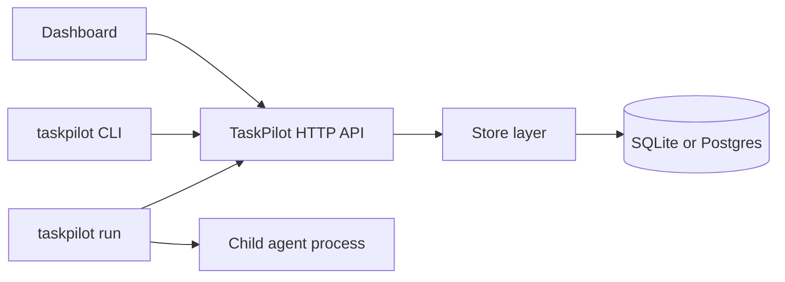

## 2. Dashboard Startup Flow

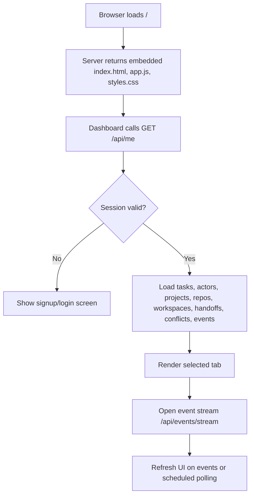

The dashboard keeps UI state in memory and selected actor/project settings in `localStorage` where possible. Rendering is delayed while a form field is focused so background refreshes do not interrupt typing.

## 3. Authentication Flow

### Signup

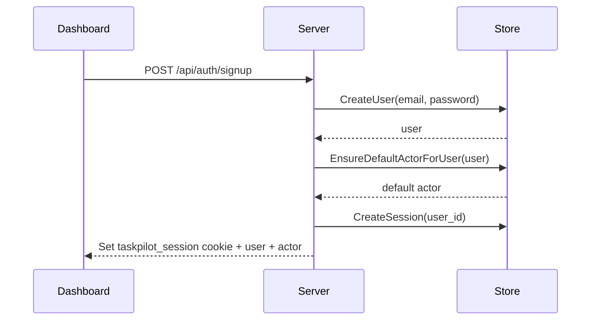

### Login

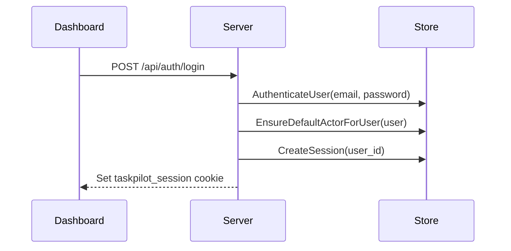

### CLI actor authentication

CLI requests send:

- `X-Actor-ID`
- `X-Actor-Secret`

The server verifies the actor secret hash, touches `last_seen_at`, and treats the actor as a legacy actor principal for the request.

## 4. Dashboard Navigation Flow

The dashboard has these primary tabs:

- `board`
- `detail`
- `projects`
- `conflicts`
- `actors`
- `handoffs`
- `settings`

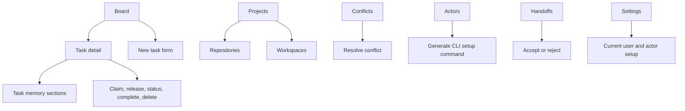

## 5. Task Board Flow

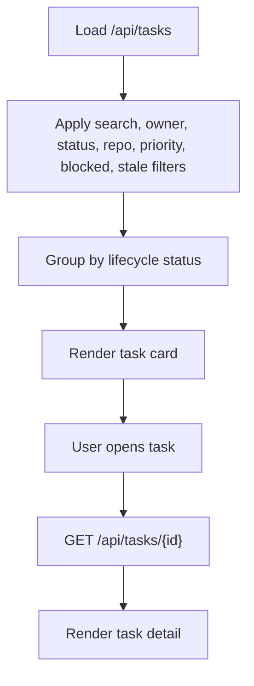

The board shows derived operational signals such as active lock count, handoff status, conflict count, subtask count, dependency count, and stale/blocked indicators.

## 6. Task Creation Flow

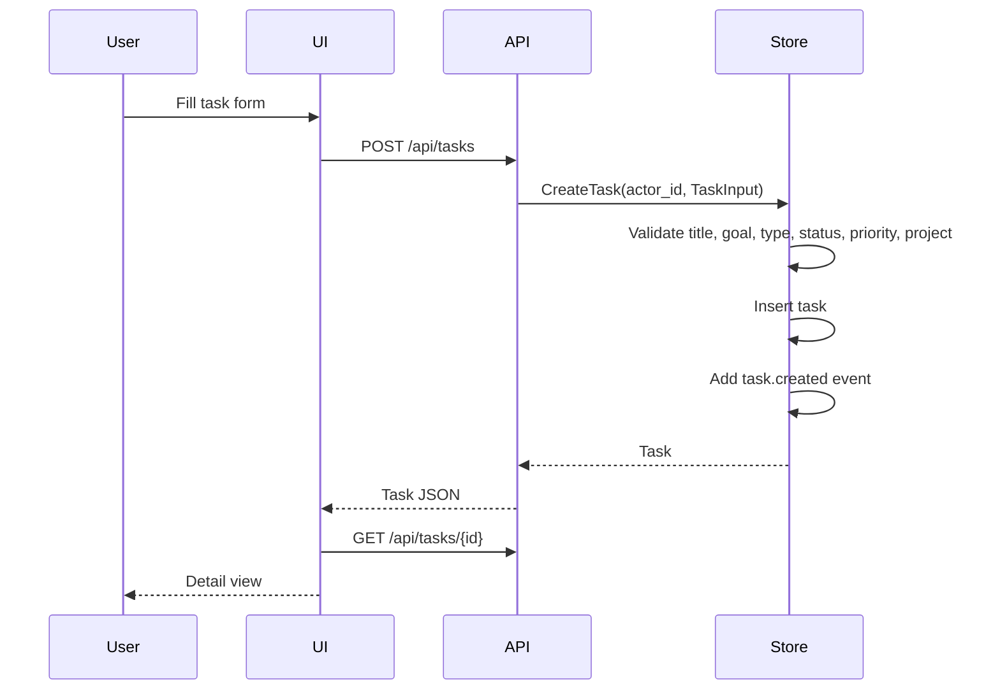

Default task values:

- project defaults to `project_default`
- type defaults to `implementation`
- status defaults to `ready`
- priority defaults to `medium`
- privacy level defaults to `internal`

## 7. Manual Work Flow

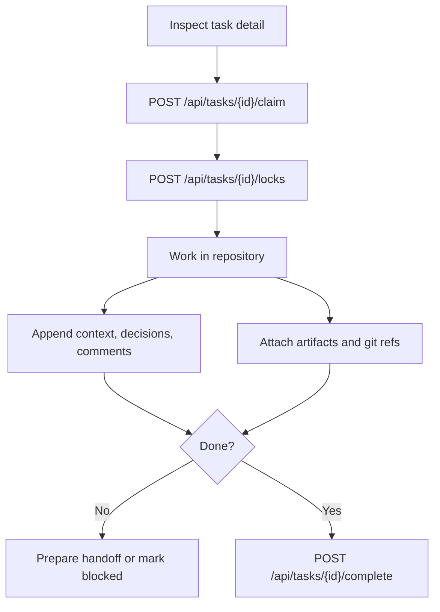

Manual work is expected to follow the same shared memory discipline as agent work: claim first, lock touched scope, and write findings/decisions as durable context.

## 8. `taskpilot run` Flow

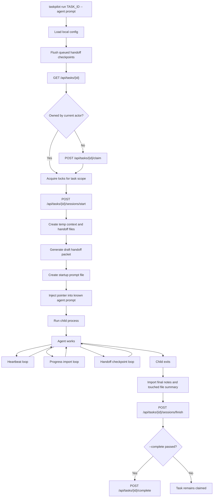

The child process receives environment variables including:

- `TASKPILOT_TASK_ID`
- `TASKPILOT_SERVER`
- `TASKPILOT_ACTOR_ID`
- `TASKPILOT_SESSION_ID`
- `TASKPILOT_HANDOFF_PACKET_ID`
- `TASKPILOT_PROJECT_ID`
- `TASKPILOT_REPO_ID`
- `TASKPILOT_WORKSPACE_ID`
- `TASKPILOT_TASK_CONTEXT_FILE`
- `TASKPILOT_RELATED_CONTEXT_FILE`
- `TASKPILOT_RUN_CONTEXT_FILE`
- `TASKPILOT_HANDOFF_FILE`
- `TASKPILOT_AGENT_PROMPT_FILE`
- `TASKPILOT_AGENT_INSTRUCTIONS`

## 9. Task Session Flow

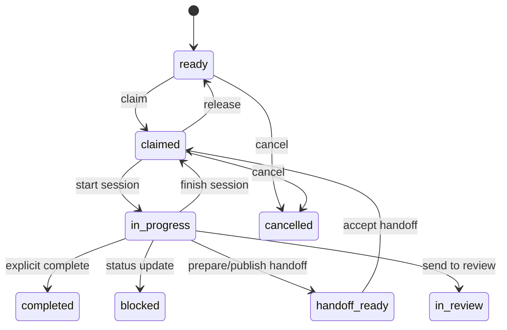

Important behavior: `FinishTaskSession` returns `in_progress` tasks to `claimed`. This prevents normal child-process exit from implying completion.

## 10. Lock and Conflict Flow

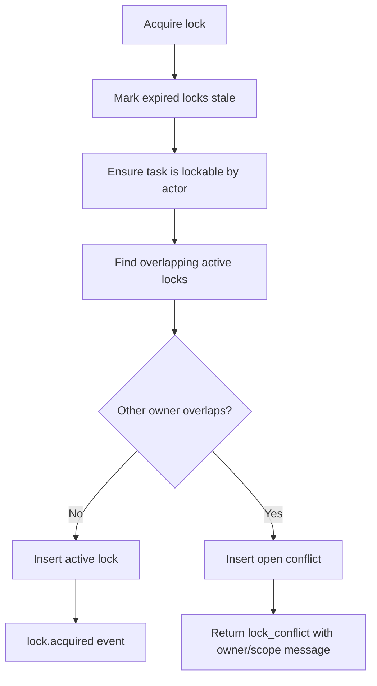

Conflict resolution can:

- keep current owner
- transfer ownership
- split scope
- pause work
- mark duplicate
- escalate

## 11. Handoff Flow

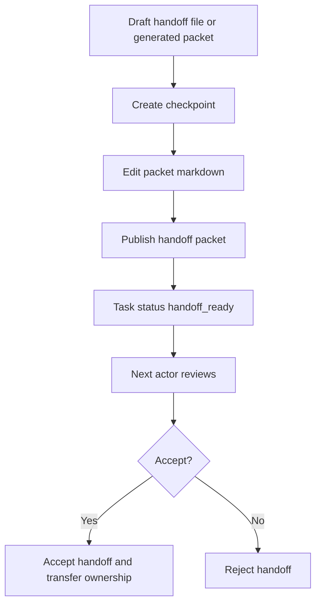

`taskpilot run` creates and updates the handoff draft during active work. If checkpoint upload is temporarily unavailable, the CLI writes a local queued checkpoint and later flushes it.

## 12. Event Flow

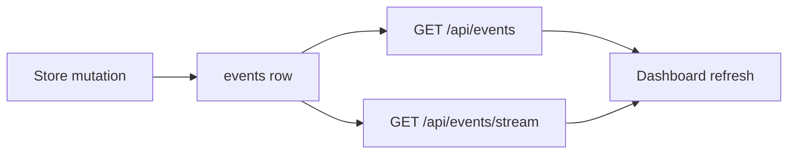

Events provide the task timeline and a lightweight live-update trigger for the dashboard.

## 13. Operational Flow

### Local SQLite

```bash
taskpilot serve --addr 127.0.0.1:8080 --db taskpilot.db
```

The server opens a SQLite file, runs migrations, serves the dashboard, and handles all API requests.

### Shared Postgres

```bash
docker compose up -d --build
```

When `TASKPILOT_DB_URL` starts with `postgres://` or `postgresql://`, the store uses the Postgres driver and rewrites SQLite-oriented SQL where needed.

