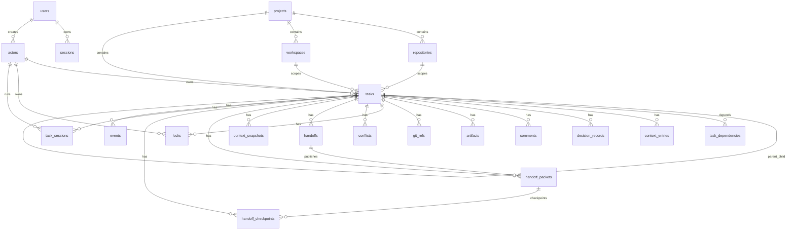

# TaskPilot Backend Schema

## 1. Backend Overview

TaskPilot is implemented as a Go server and CLI over a shared store abstraction. The same `Store` methods support SQLite and Postgres.

Backend selection:

- Values beginning with `postgres://` or `postgresql://` use Postgres through `pgx`.
- All other values use SQLite through `modernc.org/sqlite`.

The server runs migrations automatically when `OpenStore` is called.

## 2. Schema Conventions

- IDs are text strings generated with a semantic prefix such as `task_`, `actor_`, `project_`, or `handoff_`.
- Timestamps are stored as text.
- Structured arrays and objects are stored as JSON text columns.
- Most relationships are represented by ID fields, but current migrations do not declare foreign-key constraints.
- Mutations generally write an audit row to `events`.
- SQLite syntax is the source SQL; Postgres mode rewrites placeholders and a few statements at runtime.

## 3. Entity Relationship Diagram



## 4. Tables

### `users`

Human dashboard accounts.

| Column | Type | Notes |
|---|---|---|
| `id` | TEXT PRIMARY KEY | User ID |
| `email` | TEXT UNIQUE NOT NULL | Lowercased login email |
| `name` | TEXT NOT NULL | Display name |
| `password_hash` | TEXT NOT NULL | bcrypt hash |
| `active` | INTEGER NOT NULL | 1 active, 0 disabled |
| `created_at` | TEXT NOT NULL | Creation timestamp |
| `last_seen_at` | TEXT | Updated on login |

### `sessions`

Dashboard login sessions.

| Column | Type | Notes |
|---|---|---|
| `id` | TEXT PRIMARY KEY | Session ID |
| `user_id` | TEXT NOT NULL | User ID |
| `token_hash` | TEXT UNIQUE NOT NULL | SHA-256 hash of cookie token |
| `created_at` | TEXT NOT NULL | Creation timestamp |
| `expires_at` | TEXT NOT NULL | Defaults to 12 hours |
| `revoked_at` | TEXT | Set on logout or password change |

### `actors`

Agent or developer identities used for task ownership and CLI credentials.

| Column | Type | Notes |
|---|---|---|
| `id` | TEXT PRIMARY KEY | Actor ID |
| `name` | TEXT NOT NULL | Display name |
| `kind` | TEXT NOT NULL | Agent/developer/manual classification |
| `machine_name` | TEXT | Optional machine label |
| `created_at` | TEXT NOT NULL | Creation timestamp |
| `last_seen_at` | TEXT | Updated when actor authenticates |
| `actor_secret_hash` | TEXT | SHA-256 hash of actor secret |
| `created_by_user_id` | TEXT | Owning dashboard user |

### `projects`

Top-level grouping for tasks and repositories.

| Column | Type | Notes |
|---|---|---|
| `id` | TEXT PRIMARY KEY | Project ID |
| `name` | TEXT UNIQUE NOT NULL | Project name |
| `description` | TEXT NOT NULL | Description |
| `created_by` | TEXT NOT NULL | Actor/user ID |
| `created_at` | TEXT NOT NULL | Creation timestamp |

`project_default` is created automatically for existing or unscoped tasks.

### `repositories`

Repository records inside projects.

| Column | Type | Notes |
|---|---|---|
| `id` | TEXT PRIMARY KEY | Repository ID |
| `project_id` | TEXT NOT NULL | Project ID |
| `name` | TEXT NOT NULL | Repo display name |
| `path` | TEXT NOT NULL | Local/server path metadata |
| `default_branch` | TEXT NOT NULL | Defaults to `main` |
| `created_by` | TEXT NOT NULL | Actor/user ID |
| `created_at` | TEXT NOT NULL | Creation timestamp |

### `workspaces`

Machine or environment records.

| Column | Type | Notes |
|---|---|---|
| `id` | TEXT PRIMARY KEY | Workspace ID |
| `project_id` | TEXT NOT NULL | Project ID |
| `actor_id` | TEXT | Optional associated actor |
| `name` | TEXT NOT NULL | Workspace label |
| `machine_name` | TEXT | Machine name |
| `kind` | TEXT NOT NULL | Workspace type |
| `created_by` | TEXT NOT NULL | Actor/user ID |
| `created_at` | TEXT NOT NULL | Creation timestamp |
| `last_seen_at` | TEXT | Last activity |

### `tasks`

Primary work records.

| Column | Type | Notes |
|---|---|---|
| `id` | TEXT PRIMARY KEY | Task ID |
| `project_id` | TEXT NOT NULL DEFAULT `project_default` | Project ID |
| `repo_id` | TEXT | Repository ID |
| `workspace_id` | TEXT | Workspace ID |
| `parent_task_id` | TEXT | Parent task for subtasks |
| `title` | TEXT NOT NULL | Short task title |
| `goal` | TEXT NOT NULL | Desired outcome |
| `type` | TEXT NOT NULL | planning, research, implementation, review, debugging, documentation, other |
| `status` | TEXT NOT NULL | ready, claimed, in_progress, blocked, handoff_ready, in_review, completed, cancelled |
| `priority` | TEXT NOT NULL | low, medium, high, urgent |
| `owner_id` | TEXT | Current actor owner |
| `created_by` | TEXT NOT NULL | Creator actor/user |
| `created_at` | TEXT NOT NULL | Creation timestamp |
| `updated_at` | TEXT NOT NULL | Last update |
| `claim_expires_at` | TEXT | Claim TTL deadline |
| `last_heartbeat_at` | TEXT | Last owner heartbeat |
| `privacy_level` | TEXT NOT NULL | Defaults to `internal` |
| `scope_json` | TEXT NOT NULL | JSON array of scopes |
| `requirements_json` | TEXT NOT NULL | JSON array |
| `completion_criteria_json` | TEXT NOT NULL | JSON array |
| `risks_json` | TEXT NOT NULL | JSON array |
| `blockers_json` | TEXT NOT NULL | JSON array |

### `task_dependencies`

Directed task dependency edges.

| Column | Type | Notes |
|---|---|---|
| `id` | TEXT PRIMARY KEY | Dependency ID |
| `task_id` | TEXT NOT NULL | Blocked task |
| `depends_on_id` | TEXT NOT NULL | Required task |
| `created_by` | TEXT NOT NULL | Actor/user ID |
| `created_at` | TEXT NOT NULL | Creation timestamp |

Unique constraint:

```text
UNIQUE(task_id, depends_on_id)
```

### `context_entries`

Append-only task notes.

| Column | Type | Notes |
|---|---|---|
| `id` | TEXT PRIMARY KEY | Context entry ID |
| `task_id` | TEXT NOT NULL | Task ID |
| `author_id` | TEXT NOT NULL | Actor/user ID |
| `kind` | TEXT NOT NULL | summary, finding, risk, blocker, output_ref, etc. |
| `content` | TEXT NOT NULL | Note body |
| `created_at` | TEXT NOT NULL | Creation timestamp |

### `decision_records`

First-class durable decisions.

| Column | Type | Notes |
|---|---|---|
| `id` | TEXT PRIMARY KEY | Decision ID |
| `task_id` | TEXT NOT NULL | Task ID |
| `author_id` | TEXT NOT NULL | Actor/user ID |
| `decision` | TEXT NOT NULL | Decision text |
| `alternatives_json` | TEXT NOT NULL | JSON array |
| `reason` | TEXT NOT NULL | Why chosen |
| `impact` | TEXT NOT NULL | Consequence |
| `created_at` | TEXT NOT NULL | Creation timestamp |

### `comments`

Discussion notes on a task.

| Column | Type | Notes |
|---|---|---|
| `id` | TEXT PRIMARY KEY | Comment ID |
| `task_id` | TEXT NOT NULL | Task ID |
| `author_id` | TEXT NOT NULL | Actor/user ID |
| `body` | TEXT NOT NULL | Comment text |
| `created_at` | TEXT NOT NULL | Creation timestamp |

### `artifacts`

References to outputs such as PRs, reports, or external assets.

| Column | Type | Notes |
|---|---|---|
| `id` | TEXT PRIMARY KEY | Artifact ID |
| `task_id` | TEXT NOT NULL | Task ID |
| `author_id` | TEXT NOT NULL | Actor/user ID |
| `kind` | TEXT NOT NULL | pr, report, log, file, etc. |
| `title` | TEXT NOT NULL | Display title |
| `uri` | TEXT NOT NULL | External or internal URI |
| `description` | TEXT NOT NULL | Description |
| `metadata_json` | TEXT NOT NULL | JSON object |
| `created_at` | TEXT NOT NULL | Creation timestamp |

### `git_refs`

Git metadata attached to a task.

| Column | Type | Notes |
|---|---|---|
| `id` | TEXT PRIMARY KEY | Git ref ID |
| `task_id` | TEXT NOT NULL | Task ID |
| `author_id` | TEXT NOT NULL | Actor/user ID |
| `branch` | TEXT | Branch name |
| `commit_sha` | TEXT | Commit SHA |
| `pr_url` | TEXT | Pull request URL |
| `changed_files_json` | TEXT NOT NULL | JSON array |
| `note` | TEXT NOT NULL | Freeform note |
| `created_at` | TEXT NOT NULL | Creation timestamp |

### `locks`

Active, stale, released, or overridden ownership locks for scopes.

| Column | Type | Notes |
|---|---|---|
| `id` | TEXT PRIMARY KEY | Lock ID |
| `task_id` | TEXT NOT NULL | Task ID |
| `owner_id` | TEXT NOT NULL | Actor owner |
| `scope` | TEXT NOT NULL | File path, glob, semantic area, artifact, task, etc. |
| `scope_type` | TEXT NOT NULL | Scope classifier |
| `status` | TEXT NOT NULL DEFAULT `active` | active, stale, released, overridden |
| `expires_at` | TEXT NOT NULL | TTL deadline |
| `last_heartbeat_at` | TEXT NOT NULL | Last renewal |
| `created_at` | TEXT NOT NULL | Creation timestamp |
| `released_at` | TEXT | Release timestamp |
| `released_by` | TEXT | Actor/user that released |
| `release_reason` | TEXT | Release reason |
| `overridden_at` | TEXT | Override timestamp |
| `overridden_by` | TEXT | Actor/user that overrode |
| `override_reason` | TEXT | Override reason |

### `conflicts`

Conflict records created by lock overlap, stale ownership, or manual resolution workflows.

| Column | Type | Notes |
|---|---|---|
| `id` | TEXT PRIMARY KEY | Conflict ID |
| `task_id` | TEXT | Related task |
| `actor_id` | TEXT | Actor involved |
| `conflict_type` | TEXT NOT NULL | Example: `lock_overlap` |
| `status` | TEXT NOT NULL | open/resolved |
| `scope` | TEXT | Conflicting scope |
| `scope_type` | TEXT | Scope classifier |
| `current_owner_id` | TEXT | Current owner |
| `other_actor_id` | TEXT | Other actor |
| `other_task_id` | TEXT | Other task |
| `lock_id` | TEXT | Requested/related lock |
| `conflicting_lock_id` | TEXT | Existing conflicting lock |
| `resolution` | TEXT | Resolution type |
| `resolution_note` | TEXT | Explanation |
| `created_at` | TEXT NOT NULL | Creation timestamp |
| `resolved_at` | TEXT | Resolution timestamp |
| `resolved_by` | TEXT | Resolver actor/user |

### `handoffs`

Published continuation intent between actors.

| Column | Type | Notes |
|---|---|---|
| `id` | TEXT PRIMARY KEY | Handoff ID |
| `task_id` | TEXT NOT NULL | Task ID |
| `from_actor_id` | TEXT NOT NULL | Current actor |
| `to_actor_id` | TEXT | Target actor |
| `status` | TEXT NOT NULL | pending, accepted, rejected |
| `resume_summary` | TEXT NOT NULL | Summary for next actor |
| `next_steps_json` | TEXT NOT NULL | JSON array |
| `created_at` | TEXT NOT NULL | Creation timestamp |
| `accepted_at` | TEXT | Acceptance timestamp |

### `context_snapshots`

Generated or edited summaries of task state.

| Column | Type | Notes |
|---|---|---|
| `id` | TEXT PRIMARY KEY | Snapshot ID |
| `task_id` | TEXT NOT NULL | Task ID |
| `author_id` | TEXT NOT NULL | Actor/user ID |
| `source` | TEXT NOT NULL | Source of snapshot |
| `snapshot_type` | TEXT NOT NULL | Snapshot type |
| `status_at_time` | TEXT NOT NULL | Task status at generation |
| `summary_json` | TEXT NOT NULL | Structured `SnapshotContent` |
| `markdown_cache` | TEXT NOT NULL | Rendered markdown |
| `source_context_ids_json` | TEXT NOT NULL | JSON array |
| `created_at` | TEXT NOT NULL | Creation timestamp |
| `updated_at` | TEXT NOT NULL | Update timestamp |

### `handoff_packets`

Structured handoff packet plus markdown cache.

| Column | Type | Notes |
|---|---|---|
| `id` | TEXT PRIMARY KEY | Packet ID |
| `task_id` | TEXT NOT NULL | Task ID |
| `handoff_id` | TEXT | Linked handoff when published |
| `generated_by` | TEXT NOT NULL | Actor/user ID |
| `status` | TEXT NOT NULL | draft/published |
| `version` | INTEGER NOT NULL DEFAULT 1 | Packet version |
| `packet_json` | TEXT NOT NULL | Structured `HandoffPacketContent` |
| `markdown_cache` | TEXT NOT NULL | Editable markdown |
| `source_snapshot_ids_json` | TEXT NOT NULL | JSON array |
| `source_context_ids_json` | TEXT NOT NULL | JSON array |
| `source` | TEXT NOT NULL DEFAULT `generated_fallback` | Generation/edit source |
| `validation_errors_json` | TEXT NOT NULL DEFAULT `[]` | JSON array |
| `supporting_evidence_json` | TEXT NOT NULL DEFAULT `[]` | JSON array |
| `edited_by` | TEXT | Last editor |
| `created_at` | TEXT NOT NULL | Creation timestamp |
| `updated_at` | TEXT NOT NULL | Update timestamp |

### `handoff_checkpoints`

Incremental handoff drafts saved during runs.

| Column | Type | Notes |
|---|---|---|
| `id` | TEXT PRIMARY KEY | Checkpoint ID |
| `task_id` | TEXT NOT NULL | Task ID |
| `packet_id` | TEXT NOT NULL | Handoff packet ID |
| `session_id` | TEXT | Task session ID |
| `actor_id` | TEXT NOT NULL | Actor/user ID |
| `sequence` | INTEGER NOT NULL | Monotonic per packet/session sequence |
| `packet_json` | TEXT NOT NULL | Parsed structured packet |
| `markdown_cache` | TEXT NOT NULL | Checkpoint markdown |
| `validation_errors_json` | TEXT NOT NULL DEFAULT `[]` | JSON array |
| `created_at` | TEXT NOT NULL | Creation timestamp |

### `task_sessions`

Agent/developer run sessions.

| Column | Type | Notes |
|---|---|---|
| `id` | TEXT PRIMARY KEY | Session ID |
| `task_id` | TEXT NOT NULL | Task ID |
| `actor_id` | TEXT NOT NULL | Actor ID |
| `started_at` | TEXT NOT NULL | Start timestamp |
| `ended_at` | TEXT | End timestamp |
| `exit_status` | TEXT | success/failed/etc. |
| `finish_reason` | TEXT | Human-readable reason |

### `events`

Audit and timeline records.

| Column | Type | Notes |
|---|---|---|
| `id` | INTEGER PRIMARY KEY AUTOINCREMENT | Event number |
| `task_id` | TEXT | Optional task ID |
| `actor_id` | TEXT NOT NULL | Actor/user/system |
| `event_type` | TEXT NOT NULL | Event name |
| `payload_json` | TEXT NOT NULL | JSON payload |
| `created_at` | TEXT NOT NULL | Creation timestamp |

## 5. Core Data Structures

### `TaskInput`

Used for creating and updating tasks. It maps to task columns and supports JSON-array fields:

- `scope`
- `requirements`
- `completion_criteria`
- `risks`
- `blockers`

### `TaskDetail`

Composite read model returned by `GET /api/tasks/{id}`. It includes:

- task
- owner
- parent
- subtasks
- dependencies
- dependents
- context
- decisions
- comments
- artifacts
- git refs
- locks
- handoffs
- snapshots
- latest snapshot
- handoff packet
- handoff checkpoints
- events

### `SnapshotContent`

Structured summary containing:

- recent changes
- key decisions
- reasoning
- open questions
- implementation direction
- files/components
- risks
- blockers
- assumptions
- next recommended actions
- optional extra sections

### `HandoffPacketContent`

Structured continuation packet containing:

- task objective
- original requirements
- current status/current state
- timeline
- completed work
- important decisions
- rejected approaches
- architecture notes
- implementation notes
- files/components affected
- known issues
- failed sessions
- remaining work
- suggested next steps
- assumptions
- risks
- dependencies
- handoff message
- optional extra sections

## 6. Main API Surface

### Health and operations

| Method | Path | Purpose |
|---|---|---|
| GET | `/healthz` | Liveness |
| GET | `/readyz` | Store readiness |
| GET | `/metrics` | Prometheus-style metrics |

### Auth

| Method | Path | Purpose |
|---|---|---|
| POST | `/api/auth/signup` | Create user and session |
| POST | `/api/auth/login` | Authenticate user |
| POST | `/api/auth/logout` | Revoke session |
| GET | `/api/me` | Current principal |
| POST | `/api/me/password` | Change own password |

### Projects, repos, workspaces, actors

| Method | Path | Purpose |
|---|---|---|
| GET/POST | `/api/projects` | List/create projects |
| GET/POST | `/api/repositories` | List/create repositories |
| GET/POST | `/api/workspaces` | List/create workspaces |
| POST | `/api/actors/register` | Create actor |
| GET | `/api/actors` | List actors |
| PATCH/DELETE | `/api/actors/{id}` | Update/delete actor |
| POST | `/api/actors/{id}/secret` | Reset actor secret |

### Tasks and memory

| Method | Path | Purpose |
|---|---|---|
| GET/POST | `/api/tasks` | List/create tasks |
| GET/PATCH/DELETE | `/api/tasks/{id}` | Detail/update/delete task |
| DELETE | `/api/tasks/{id}/memory` | Delete task memory |
| POST | `/api/tasks/{id}/subtasks` | Create subtask |
| POST | `/api/tasks/{id}/dependencies` | Add dependency |
| DELETE | `/api/dependencies/{id}` | Remove dependency |
| POST | `/api/tasks/{id}/claim` | Claim task |
| POST | `/api/tasks/{id}/release` | Release task |
| POST | `/api/tasks/{id}/heartbeat` | Refresh claim/locks |
| POST | `/api/tasks/{id}/complete` | Complete task |
| POST/GET | `/api/tasks/{id}/context` | Append/list context |
| POST/GET | `/api/tasks/{id}/decisions` | Add/list decisions |
| POST/GET | `/api/tasks/{id}/comments` | Add/list comments |
| POST/GET | `/api/tasks/{id}/artifacts` | Add/list artifacts |
| POST/GET | `/api/tasks/{id}/git` | Add/list git refs |

### Sessions, locks, conflicts, handoffs

| Method | Path | Purpose |
|---|---|---|
| POST | `/api/tasks/{id}/sessions/start` | Start session |
| POST | `/api/tasks/{id}/sessions/finish` | Finish session |
| POST/GET | `/api/tasks/{id}/locks` | Acquire/list locks |
| POST | `/api/locks/{id}/release` | Release lock |
| POST | `/api/locks/{id}/renew` | Renew lock |
| POST | `/api/locks/{id}/override` | Override lock |
| GET | `/api/conflicts` | List conflicts |
| GET | `/api/conflicts/stale-claims` | List stale claims |
| POST | `/api/conflicts/{id}/resolve` | Resolve conflict |
| POST | `/api/tasks/{id}/handoff` | Prepare handoff |
| POST | `/api/handoffs/{id}/accept` | Accept handoff |
| POST | `/api/handoffs/{id}/reject` | Reject handoff |
| GET | `/api/handoffs` | List handoffs |

### Snapshots and packets

| Method | Path | Purpose |
|---|---|---|
| POST/GET | `/api/tasks/{id}/snapshots` | Create/list snapshots |
| PATCH | `/api/snapshots/{id}` | Update snapshot markdown |
| POST | `/api/tasks/{id}/handoff-packet/generate` | Generate packet |
| GET | `/api/tasks/{id}/handoff-packet` | Latest packet |
| PATCH | `/api/handoff-packets/{id}` | Update packet markdown |
| POST | `/api/handoff-packets/{id}/publish` | Publish packet |
| POST/GET | `/api/tasks/{id}/handoff-checkpoints` | Create/list checkpoints |
| GET | `/api/events` | List events |
| GET | `/api/events/stream` | Event stream |

## 7. Store Behavior Notes

### Task claim TTL

Default task claim TTL:

```text
15 minutes
```

### Lock TTL

Default lock TTL:

```text
30 minutes
```

### Heartbeat behavior

Task heartbeat updates:

- `tasks.last_heartbeat_at`
- `tasks.claim_expires_at`
- active task locks through renewal helpers

### Session finish behavior

When a task session finishes, an `in_progress` task is moved back to `claimed` unless a separate complete action is called.

### Handoff checkpoint sequence

Checkpoints are sequenced per packet/session and preserve both markdown and parsed packet content.

## 8. Local CLI Persistence

The CLI also stores local, non-server state:

- CLI config with server URL, email, actor ID, and actor secret.
- Temporary run context files for active `taskpilot run` sessions.
- Queued handoff checkpoint files when upload fails with a retriable request error.

These local files are operational aids. The server database remains the source of truth for shared state.

