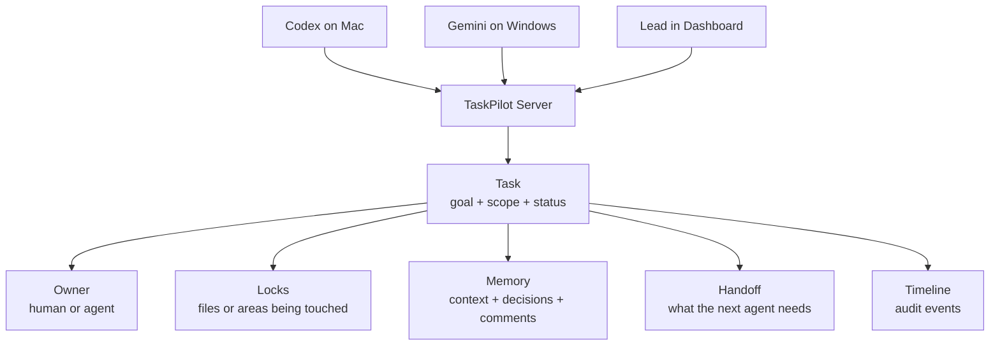

# TaskPilot Onboarding Guide

This guide is for a new internal team that wants to use TaskPilot with humans, Codex, Gemini, or other CLI agents.

TaskPilot helps the team answer five questions:

- Who owns this task right now?
- What is the agent working on?
- Which files or areas are locked?
- What decisions were already made?
- Can another agent continue without losing context?

The short version:

```text
TaskPilot is shared memory, ownership, locks, and handoff workflow for agent-driven software work.
```

## The Mental Model



Everything revolves around the task. The task is not just a todo item. It contains the goal, owner, scope, current state, decisions, handoff memory, locks, artifacts, git metadata, and timeline.

## What TaskPilot Gives The Team

### Humans get visibility

The dashboard shows:

- Task board by status.
- Task detail.
- Current owner.
- Context and decisions.
- Locks and conflicts.
- Handoffs.
- Artifacts and git links.
- Subtasks and dependencies.
- Audit timeline.

Value:

Humans do not need to open every terminal to understand what agents are doing.

### Agents get context

Agents launched with `taskpilot run` receive:

- Current task JSON.
- Related prior task context.
- Handoff memory.
- Environment variables.
- A startup prompt with TaskPilot rules.
- A file for incremental notes.
- A file for transfer-ready handoff memory.

Value:

The agent does not need a human to paste task history manually.

### Teams get safer parallel work

TaskPilot tracks ownership and locks.

Value:

Two agents should not silently work on the same task or same scope without a warning.

### Handoffs become reliable

TaskPilot has an agent-authored handoff file. The agent updates it after each meaningful work unit and checkpoints it to the server.

Value:

The next agent sees completed work, decisions, current state, remaining work, and next steps instead of a vague chat summary.

## Important Words

### Task

The unit of work.

Example:

```text
Title: Fix invited-user signup
Goal: Find and fix why invited users cannot complete signup.
Scope: src/auth/*
```

### Actor

A human or agent identity.

Examples:

```text
Codex CLI - Mac
Gemini CLI - Windows
Anuj - Tech Lead
```

### Claim

The actor says, "I own this task right now."

### Lock

The actor says, "I am touching this file or area."

Examples:

```text
README.md
src/auth/*
billing/refunds
task:<task-id>
```

### Context

Small structured notes attached to the task.

Examples:

```text
summary: Found expiry bug after invite lookup.
decision: Keep token format unchanged.
risk: Timezone edge cases may need coverage.
output_ref: PR https://github.com/acme/app/pull/42
```

### Decision

A durable record of why something was chosen.

Example:

```text
Decision: Keep token format unchanged.
Reason: Existing invite links must keep working.
Impact: Patch only expiry validation.
```

### Handoff

A prepared continuation packet for the next agent or developer.

Good handoff sections:

- Completed Work
- Important Decisions
- Current State
- Remaining Work
- Suggested Next Steps
- Files / Components Affected
- Risks and blockers
- Handoff Message

## First-Time Setup

### 1. Start the server

Local development:

```bash
taskpilot serve --addr 127.0.0.1:8080 --db taskpilot.db
```

Docker with Postgres:

```bash
docker compose up --build
```

Check:

```bash
curl http://127.0.0.1:8080/healthz
curl http://127.0.0.1:8080/readyz
```

### 2. Open the dashboard

Local:

```text
http://127.0.0.1:8080
```

Another laptop:

```text
http://<server-lan-ip>:8080
```

### 3. Install the CLI on PATH

Agents should be able to run `taskpilot` from any repo.

Mac/Linux:

```bash
git pull
make install
```

Windows:

```powershell
git pull
powershell -ExecutionPolicy Bypass -File .\scripts\install-windows.ps1
```

Check:

```bash
taskpilot config show
```

Mac/Linux should show `~/.local/bin/taskpilot`:

```bash
which taskpilot
ls -l "$(which taskpilot)"
```

Windows should show `%USERPROFILE%\.local\bin\taskpilot.exe`:

```powershell
where.exe taskpilot
Get-Item (where.exe taskpilot | Select-Object -First 1) | Format-List FullName,Length,LastWriteTime
```

### 4. Log in and connect an actor

Dashboard login is email/password only. Actor management happens after login.

1. Open the TaskPilot dashboard.
2. Sign up or log in with email and password.
3. Open **Actors**.
4. Create an actor for the agent or developer mode, such as `anuj_codex`, `anuj_gemini`, or `rahul_claude`.
5. Open **Settings** and copy the CLI setup command for that actor.

Mac example:

```bash
taskpilot login --server http://127.0.0.1:8080 --email anuj@company.com
taskpilot config set-actor <actor-id> <actor-secret>
```

Windows example:

```powershell
taskpilot login --server http://<server-lan-ip>:8080 --email teammate@company.com
taskpilot config set-actor <actor-id> <actor-secret>
```

## Everyday Workflow

### Create a task

```bash
taskpilot task create \
  --title "Improve README architecture docs" \
  --goal "Make README architecture explanation clear and brief." \
  --type documentation \
  --priority normal \
  --scope "README.md"
```

### Run an agent through TaskPilot

```bash
taskpilot run <task-id> -- codex "Improve the README architecture section. Keep it brief and easy to understand."
```

or:

```bash
taskpilot run <task-id> -- gemini "Continue from the TaskPilot handoff and complete the next steps."
```

Do not manually paste all task context. `taskpilot run` injects it.

The terminal will show:

```text
TaskPilot: injected task context into codex prompt. Full injected prompt: /tmp/taskpilot-...-prompt-....txt
TaskPilot: handoff draft file: /tmp/taskpilot-...-handoff-....md
TaskPilot: after each meaningful work unit, update the handoff draft and run: taskpilot handoff checkpoint ...
```

### What the agent should do

The agent should:

1. Read the injected task context file.
2. Read the injected related-context file.
3. Work only inside the task scope.
4. Write incremental notes to `TASKPILOT_RUN_CONTEXT_FILE`.
5. Update `TASKPILOT_HANDOFF_FILE` after each meaningful work unit.
6. Run `taskpilot handoff checkpoint`.
7. Leave the task `claimed` unless a human or explicit command marks it completed.

### What happens when the agent exits

TaskPilot does not automatically mark the task completed.

Instead:

```text
ready -> claimed -> in_progress -> claimed
```

Completion is deliberate:

```bash
taskpilot task complete <task-id> --summary "README architecture section updated and reviewed."
```

Value:

Stopping an agent session does not falsely mean the work is done.

## Handoff Checkpoints

A checkpoint is one completed work unit.

Example:

```text
Prompt 1: create PLANNING.md
Checkpoint 1: planning doc created, decisions recorded

Prompt 2: add technology section
Checkpoint 2: technology section added, current state updated

Prompt 3: tighten risks
Checkpoint 3: risks updated, remaining work now empty
```

After each unit, the agent should update:

```text
TASKPILOT_HANDOFF_FILE
```

Then run:

```bash
taskpilot handoff checkpoint "$TASKPILOT_TASK_ID" --file "$TASKPILOT_HANDOFF_FILE"
```

The latest handoff keeps:

- Completed work accumulated across checkpoints.
- Decisions accumulated across checkpoints.
- Current state from the latest checkpoint.
- Suggested next steps from the latest checkpoint only.
- Older next steps in the historical timeline.

If the handoff is weak, TaskPilot warns:

```text
TaskPilot handoff needs attention before another agent can continue reliably:
  - Completed Work: completed work is required
  - Important Decisions: important decisions are required
```

This is intentional. It stops weak handoff memory from silently becoming the source of truth.

## Dashboard Guide

### Task Board

Use it to see:

- Ready tasks.
- Claimed tasks.
- Active in-progress work.
- Blocked work.
- Handoff-ready work.
- Review and completed work.

Search and filters help by project, owner, status, repo, priority, blocked state, stale state, title, goal, context, and decisions.

### Task Detail

Use it to inspect one task:

- Goal and status.
- Owner.
- Project, repo, workspace.
- Parent, subtasks, dependencies.
- Task memory.
- Recent handoff.
- Decisions.
- Comments.
- Artifacts.
- Git metadata.
- Locks.
- Handoffs.
- Timeline.

### Task Memory

Use this area to understand the current state.

Actions:

- Generate snapshot.
- Show best memory.
- Show recent handoff.
- Prepare handoff for other agent.

The recent handoff preview lets a developer check what the next agent will receive before publishing.

### Prepare Handoff

In task detail, click:

```text
Prepare handoff for other agent
```

A modal opens with:

- Summary.
- Next steps.
- Editable preview.
- Publish button.

Publishing moves the task to `handoff_ready` and shows it on the Handoffs page.

### Handoffs Page

Use this page when another actor should continue.

The receiving actor can:

1. Read the handoff.
2. Accept it.
3. Run:

```bash
taskpilot run <task-id> -- codex "Continue from the accepted handoff."
```

### Conflicts Page

Use this when TaskPilot detects overlapping work.

It shows:

- Which tasks conflict.
- Which actors are involved.
- Which scope overlaps.
- Why the conflict happened.
- Whether a claim is stale.
- Suggested actions.

Resolution options:

- Continue current owner.
- Transfer ownership.
- Split scope.
- Pause secondary work.
- Mark duplicate.
- Escalate to human.

## Two-Agent Scenario

This checks the real value of TaskPilot.

Goal:

```text
Codex on Mac starts the work.
Gemini on Windows continues from the handoff.
Both use the same TaskPilot server and same git repo.
```

### 1. Create task on Mac

```bash
taskpilot task create \
  --title "Create Snake planning doc" \
  --goal "Create PLANNING.md for a simple 2D Snake game. Do not implement the game." \
  --type planning \
  --priority normal \
  --scope "PLANNING.md" \
  --json
```

Save the task id.

### 2. Codex works on Mac

```bash
taskpilot run <task-id> -- codex "Create the planning doc only. Record completed work, decisions, and next steps in the handoff."
```

Expected:

- Task becomes `in_progress`.
- Codex creates or edits `PLANNING.md`.
- Codex updates `TASKPILOT_HANDOFF_FILE`.
- Codex runs a handoff checkpoint.
- Dashboard shows context and handoff memory.
- When Codex exits, task returns to `claimed`.

### 3. Publish handoff

From dashboard:

1. Open task detail.
2. Click "Show Recent Handoff".
3. Review the handoff.
4. Click "Prepare handoff for other agent".
5. Edit summary and next steps if needed.
6. Publish.

Task becomes `handoff_ready`.

### 4. Gemini accepts on Windows

```powershell
taskpilot handoff accept <handoff-id>
taskpilot run <task-id> -- gemini "Continue from the accepted handoff. Add the technology section and update the handoff checkpoint."
```

Expected:

- Gemini receives prior Codex handoff context.
- Gemini does not repeat completed work.
- Gemini adds only the missing section.
- Gemini records its own checkpoint.
- The handoff timeline shows what Codex did and what Gemini did.

## What To Tell Agents

Use a short human prompt. Do not paste all context manually.

Good:

```text
Work on the current TaskPilot task. Follow the injected TaskPilot instructions. Focus on the task scope. Update the handoff file and checkpoint after this work unit.
```

Better with a concrete goal:

```text
Continue from the accepted TaskPilot handoff. Add the technology section to PLANNING.md. Do not implement the game. Update TASKPILOT_HANDOFF_FILE and run the checkpoint command before stopping.
```

TaskPilot injects the rest.

## Troubleshooting

### `taskpilot` command not found

The CLI is not on PATH. Install it into a global folder and retry:

```bash
which taskpilot
taskpilot task list
```

### Dashboard login rejected

Use the email and password created from the dashboard signup flow. TaskPilot no longer uses dashboard team tokens.

If browser state is stale:

```js
localStorage.clear()
location.reload()
```

### Windows cannot reach Mac server

From Windows:

```powershell
curl http://<mac-lan-ip>:8080/healthz
```

If it fails:

- Check both laptops are on the same network.
- Check Docker or the server process is running.
- Check port `8080` is exposed.
- Check macOS firewall.

### Handoff is empty or weak

Check whether the agent updated:

```text
TASKPILOT_HANDOFF_FILE
```

Then run:

```bash
taskpilot handoff checkpoint <task-id> --file "<handoff-file-path>"
```

If TaskPilot printed a warning, it also kept the temp handoff file on disk for repair.

### Context does not show in the dashboard while running

The agent must write useful lines to:

```text
TASKPILOT_RUN_CONTEXT_FILE
```

and checkpoint handoff memory through:

```bash
taskpilot handoff checkpoint "$TASKPILOT_TASK_ID" --file "$TASKPILOT_HANDOFF_FILE"
```

## Success Criteria

TaskPilot is working well when:

- Agents can run `taskpilot` from any repo.
- A task has a clear owner and scope.
- The dashboard shows active agent work.
- Locks explain who is touching what.
- Conflicts are visible early.
- Handoffs contain completed work and decisions, not placeholders.
- The next agent can continue without asking what happened.
- Completion only happens deliberately.
