# TaskPilot Working Flow

This guide explains TaskPilot as a set of small flows. Each diagram is intentionally split by responsibility so a new human or agent can understand the system without reading the code first.

## One-Minute Picture

TaskPilot is the shared coordination layer between humans, agents, and the repository. The dashboard and CLI both talk to the same server, and the server is the source of truth for tasks, owners, locks, memory, handoffs, and audit events.

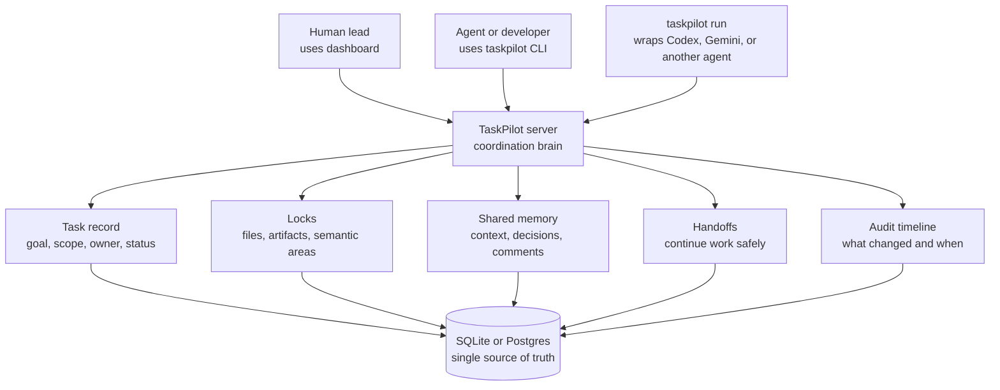

Read it as:

1. Humans and agents do not coordinate through private notes.
2. They coordinate through the TaskPilot server.
3. The server records every important ownership, work, memory, and handoff change.
4. The database can be SQLite for local use or Postgres for shared team use.

## Main Actors

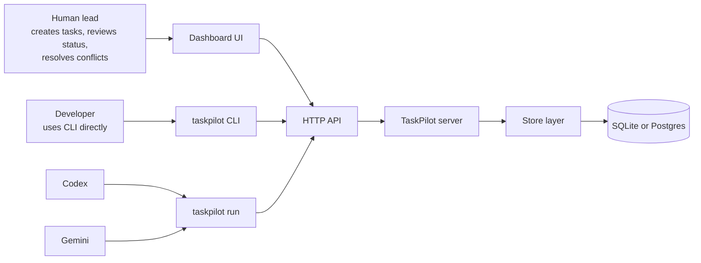

Important idea:

- The dashboard is for visibility and human control.
- The CLI is for task operations from a terminal.
- `taskpilot run` is the agent wrapper that adds claims, locks, heartbeats, context files, and handoff files around the real agent command.
- All normal coordination commands go through the server API.

## Task Lifecycle

Every piece of work starts as a task. A task moves through clear states so everyone can see whether it is free, owned, active, blocked, ready for handoff, under review, or finished.

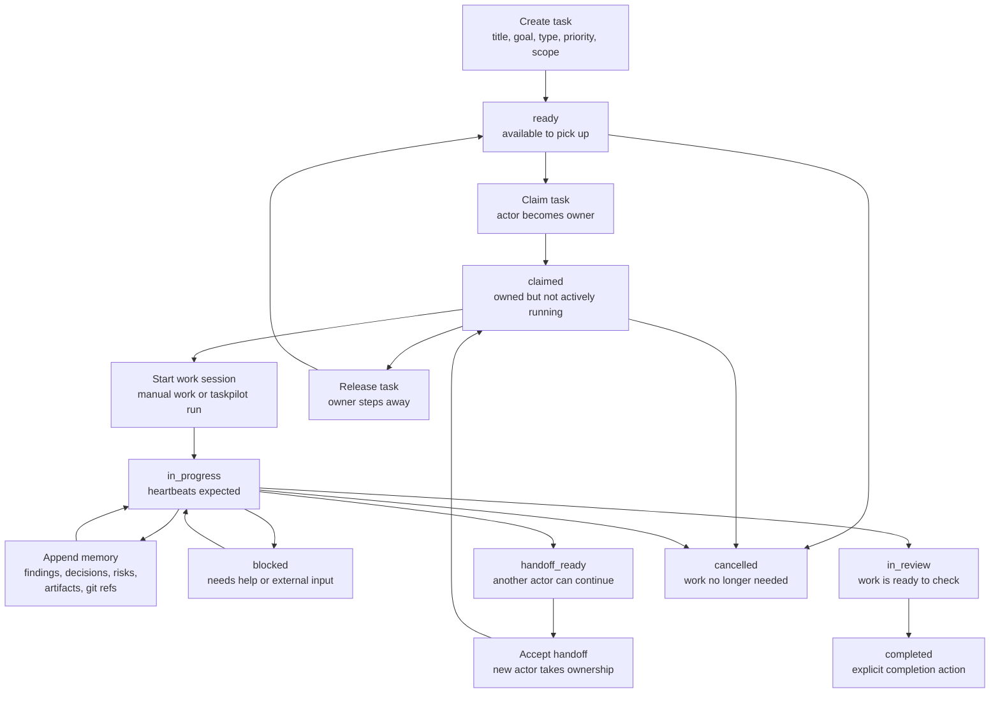

Status meaning:

- `ready`: nobody owns it yet.
- `claimed`: someone owns it, but there is no active run session.
- `in_progress`: work is active and should send heartbeats.
- `blocked`: work cannot continue without help.
- `handoff_ready`: current owner prepared continuation details.
- `in_review`: implementation is ready for review.
- `completed`: task is done only after an explicit complete action.
- `cancelled`: task is intentionally stopped.

## Normal Manual Task Flow

This is the simplest path when a person or agent uses direct CLI commands.

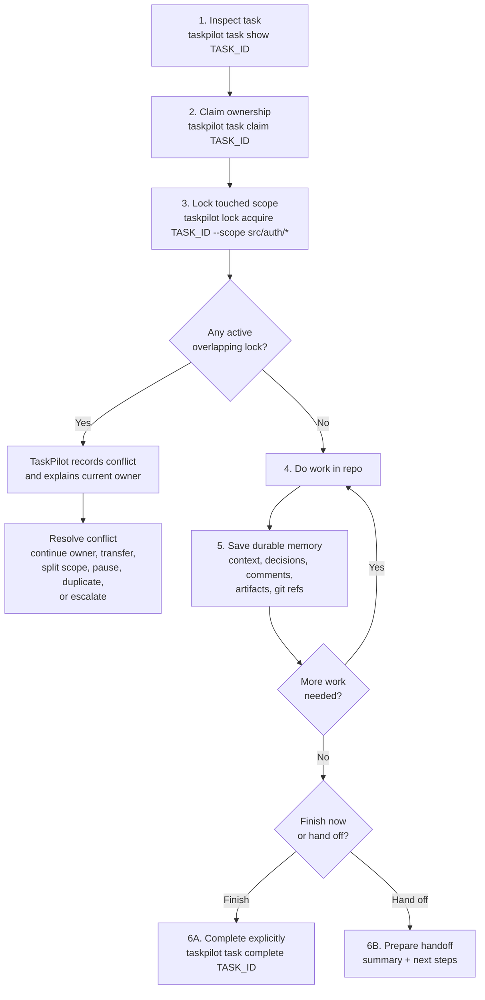

This flow prevents two people from silently editing the same area and keeps decisions attached to the task instead of buried in chat.

## `taskpilot run` Agent Flow

`taskpilot run` is the most important automation path. It wraps a child agent command with coordination steps before, during, and after the agent works.

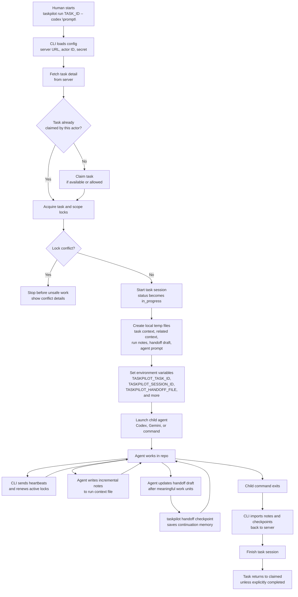

Key point:

`taskpilot run` may create local temporary files for the child agent, but those files are not the long-term source of truth. The server database remains the shared record.

## Locks And Conflict Flow

Locks make parallel work safer. A lock can cover a file, directory, artifact, task, or semantic area. TaskPilot checks for overlapping active locks before granting a new one.

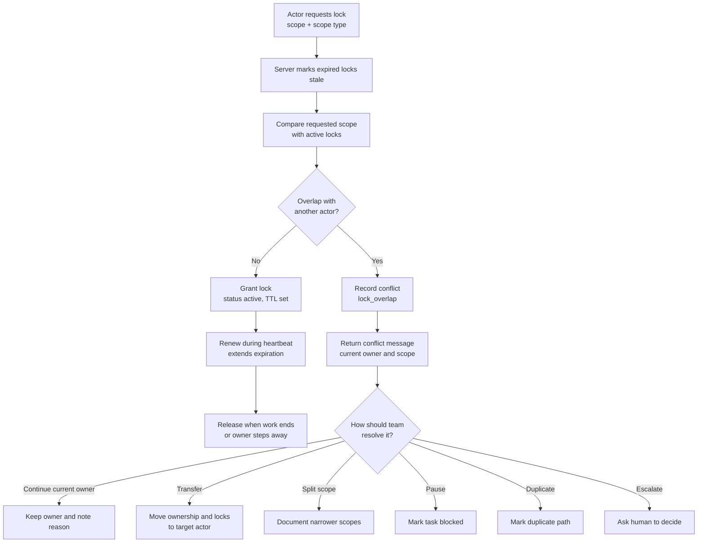

Why this matters:

- Agents can work in parallel without guessing who owns a file or area.
- Stale locks can be detected when heartbeats stop.
- Conflict decisions become durable context, not tribal memory.

## Memory Flow

TaskPilot treats context as part of the task, not as disposable chat history.

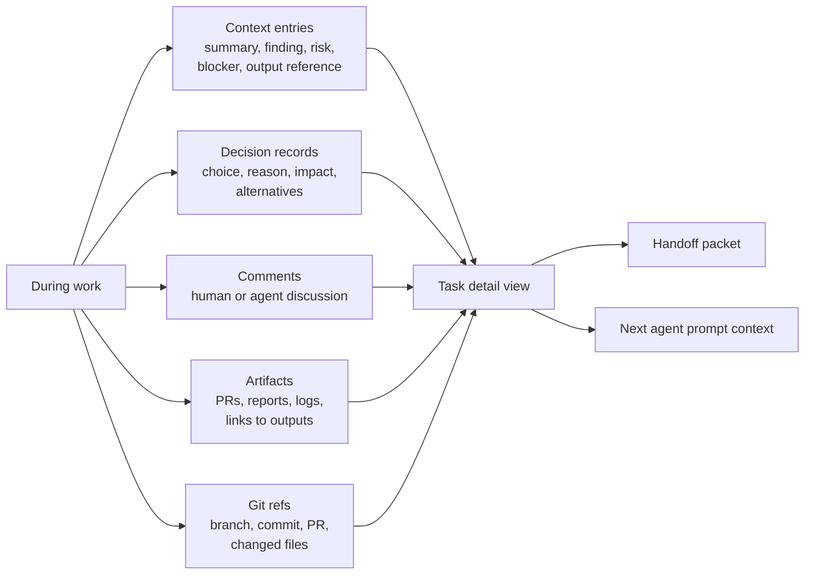

This is how the next actor understands:

- what was tried
- what was decided
- what is risky
- what files changed
- what output proves progress
- what still needs attention

## Handoff Flow

Handoff is the continuation path when work should move from one actor to another.

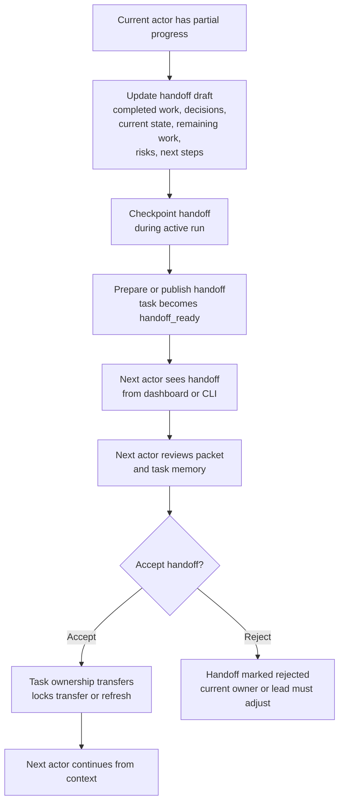

A good handoff should answer:

- What is already done?
- What important decisions were made?
- What is the current state?
- What remains?
- Which files or components were touched?
- What risks or blockers exist?
- What should the next actor do first?

## Completion Flow

Completion is intentionally separate from `taskpilot run` finishing. A child agent exiting does not mean the task is complete.

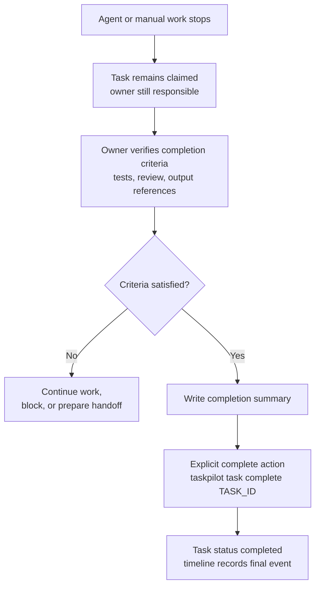

This prevents accidental completion just because an agent process exited successfully.

## Storage Flow

TaskPilot uses one active storage backend per server process.

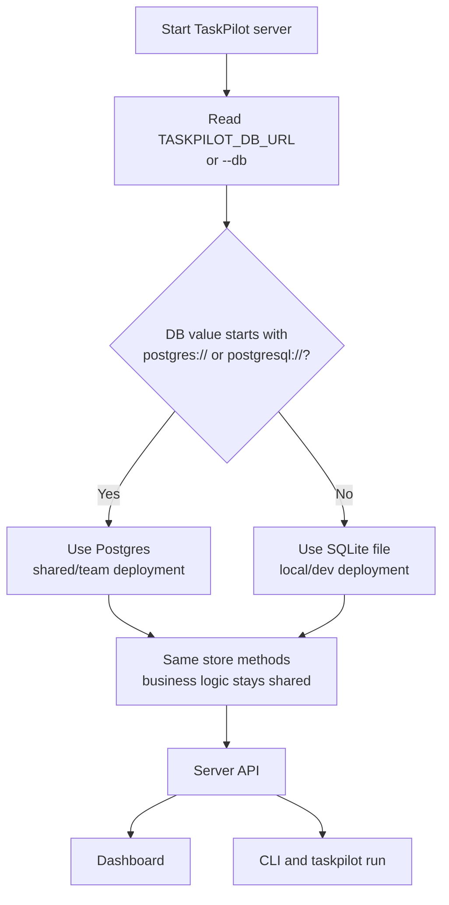

What this means in plain language:

- The CLI normally does not open the database directly.
- The dashboard does not have a separate database.
- SQLite and Postgres are not both active for the same live server.
- The server chooses one backend at startup, then all normal work goes through that server.

## Complete Working Flow

This is the whole working model as a compact end-to-end flow.

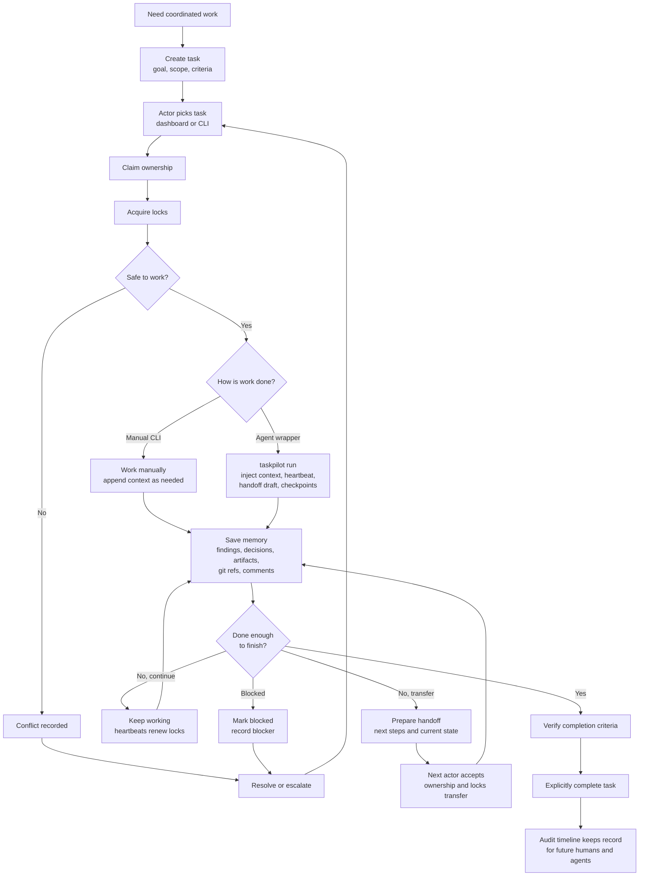

The shortest mental model:

```text
Task -> Claim -> Lock -> Work -> Remember -> Handoff or Complete
```

TaskPilot adds the safety rails around that simple loop:

- ownership so everyone knows who is responsible
- locks so parallel work does not collide silently
- heartbeats so stale work can be detected
- shared memory so context survives between agents
- handoffs so the next actor can continue without starting over
- audit events so the team can reconstruct what happened
